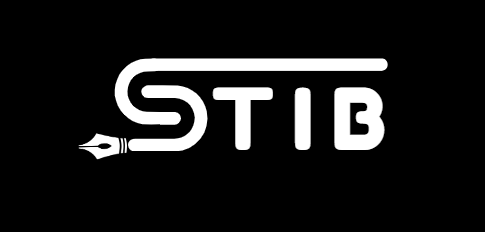

# Ean Steve Garciano

 

Visit my [Portfolio](https://stibgee.github.io/IstibPortffolio/)

# 💫 About Me:
I am a passionate Frontend Developer with a focus on UI/UX design. My goal is to contribute to innovative projects that provide exceptional user experiences.

## 🌐 Socials:
   

# 💻 Tech Stack:
            
# 📊 GitHub Stats:

# Projects:

Here are some of my notable projects:

  

    <h3>SchedAi</h3>
    
Ai-Driven  Faculty Scheduler Prototype Using Figma.

    <a href="https://www.figma.com/proto/zjG7E990cU13mYYizX9BS3/SchedAi?t=aViQHBYc2jUVaCC5-1" style="display: inline-block; margin-top: 10px; padding: 8px 12px; background-color: #0366d6; color: white; text-decoration: none; border-radius: 5px;">Visit Link</a>
  

  

    <h3>Sale Savant</h3>
    
POS, Sales Tracking And Menu Inventory Prototype Using Figma.

    <a href="https://www.figma.com/proto/iJMxftJMyY0jlgngaQKwSy/WebHEX(SupplySavant)?t=IkNB8Q9wieomiQ7e-1" style="display: inline-block; margin-top: 10px; padding: 8px 12px; background-color: #0366d6; color: white; text-decoration: none; border-radius: 5px;">Visit Link</a>
  

  

    <h3>MotoRent</h3>
    
Motor Rental Prototype Using Figma

    <a href="https://www.figma.com/design/reQZNPJX4Za4Ly6ZiCcreX/webdev?node-id=3-6083&t=Dqdx1eWdYuIJW1Ni-1" style="display: inline-block; margin-top: 10px; padding: 8px 12px; background-color: #0366d6; color: white; text-decoration: none; border-radius: 5px;">Visit Link</a>
  

    <h3>Weblog</h3>
    
Industry Visit Weblog

    <a href="https://stibgee.github.io/Weblog-IndustryVisit2024/" style="display: inline-block; margin-top: 10px; padding: 8px 12px; background-color: #0366d6; color: white; text-decoration: none; border-radius: 5px;">Visit Link</a>
  

Feel free to explore these projects and provide any feedback or contributions!

<!-- Proudly created with GPRM ( https://gprm.itsvg.in ) -->
